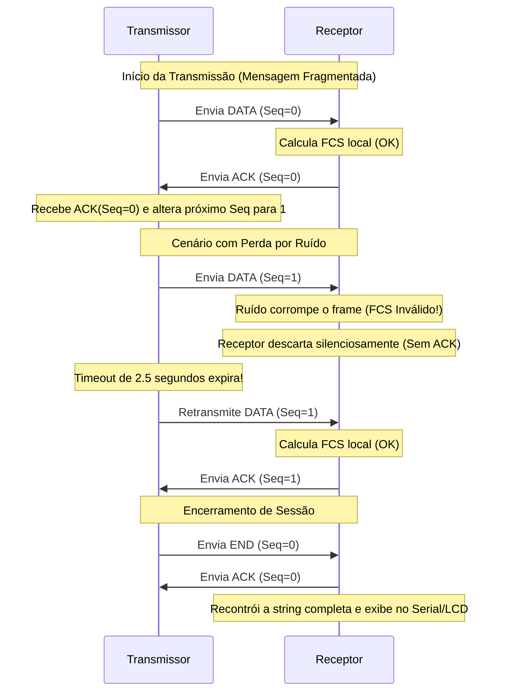

# Projeto Final: Transmissão de Dados Confiável via Rádio (433 MHz)
Este repositório contém a implementação do projeto final para a disciplina de **Transmissão e Comunicação de Dados** do Instituto Federal de Educação, Ciência e Tecnologia de Mato Grosso (IFMT).

O objetivo do projeto é estabelecer uma comunicação sem fio confiável e resiliente entre duas placas ESP32 utilizando módulos de radiofrequência (RF) de 433 MHz em nível de enlace de dados, aplicando conceitos teóricos de **estruturação de quadros**, **detecção de erros (FCS)** e **controle de fluxo/erro (Stop-and-Wait ARQ)**.

---

## Sumário
1. [Arquitetura de Hardware e Conexões](#-arquitetura-de-hardware-e-conexões)
2. [Estrutura do Quadro (Frame Format)](#-estrutura-do-quadro-frame-format)
3. [Detecção de Erros (FCS - Frame Check Sequence)](#-detecção-de-erros-fcs---frame-check-sequence)
4. [Controle de Fluxo e Erro: Stop-and-Wait ARQ](#-controle-de-fluxo-e-erro-stop-and-wait-arq)
5. [Injeção e Simulação de Erros](#-injeção-e-simulação-de-erros)
6. [Guia de Instalação e Execução](#-guia-de-instalação-e-execução)
7. [Logs de Execução Demonstrativos](#-logs-de-execução-demonstrativos)
8. [Próximos Passos (LCD e Imagens)](#-próximos-passos-lcd-e-imagens)

---

## Arquitetura de Hardware e Conexões

O sistema é composto por dois nós independentes baseados no microcontrolador **ESP32** que se comunicam em modo **Half-Duplex** utilizando módulos transmissores/receptores de RF de 433 MHz.

### Materiais Utilizados:
*   **2x** Placas de Desenvolvimento ESP32 (NodeMCU / DevKit).
*   **2x** Módulos RF 433 MHz (Ex: Par Transmissor MX-FS-03V e Receptor MX-05V).
*   **1x** Display LCD 16x2 com Módulo I2C (conectado ao Receptor).
*   **2x** Protoboards e cabos jumpers para conexões.

### Pinagem de Conexão (Fiação):

| Componente RF (TX / RX) | Pino no ESP32 | Função / Descrição |
| :--- | :--- | :--- |
| **Transmissor (Data)** | **GPIO 25** | Saída digital para modulação do sinal de rádio |
| **Receptor (Data)** | **GPIO 26** | Entrada digital de dados vindos do rádio receptor |
| **Módulo I2C LCD (SDA)** | **GPIO 21** | Barramento de dados I2C (apenas no Receptor) |
| **Módulo I2C LCD (SCL)** | **GPIO 22** | Barramento de clock I2C (apenas no Receptor) |
| **VCC (Módulos)** | **5V / VIN** | Alimentação dos módulos RF e LCD |
| **GND (Módulos)** | **GND** | Terra de referência comum |

> [!NOTE]
> Para obter uma distância estável acima de 1 metro (conforme os critérios de aceitação do projeto), é altamente recomendável soldar um fio rígido de cobre de **17.3 cm** (equivalente a um quarto de onda de 433 MHz) em cada uma das antenas dos módulos RF.

---

## Estrutura do Quadro (Frame Format)

Para encapsular as informações enviadas pelo canal físico e garantir que o receptor consiga delimitar onde começa e termina um pacote, foi projetada uma estrutura de **quadro customizada**, inspirada em protocolos de nível de enlace clássicos.

A estrutura do frame possui tamanho variável entre **6 e 30 bytes**:

| MAGIC (1B)  |  TYPE (1B)  |  SEQ (1B)   |  LEN (1B)   | PAYLOAD (0-24B)     | FCS (2B, LSB/MSB) |
|-------------|-------------|-------------|-------------|---------------------|-------------------|
|    0xA5     | 0x01/02/03  |    0 / 1    |  0 a 24     | Dados da Mensagem   | Checksum ou CRC16 |

### Campos do Quadro:
1.  **MAGIC BYTE (`0xA5`) [1 Byte]:** Assinatura fixa do frame. Usada pelo receptor para sincronizar o início do quadro e rejeitar ruídos espúrios aleatórios recebidos no canal de rádio.
2.  **TYPE [1 Byte]:** Define o propósito do quadro:
    *   `0x01` (`TYPE_DATA`): Contém fragmento dos dados úteis da mensagem.
    *   `0x02` (`TYPE_ACK`): Sinal de confirmação de recebimento bem-sucedido.
    *   `0x03` (`TYPE_END`): Sinaliza o fim de uma sessão de transmissão de dados.
3.  **SEQ [1 Byte]:** Número de sequência de 1 bit (`0` ou `1`), fundamental para controle de fluxo e descarte de quadros duplicados no Stop-and-Wait.
4.  **LEN [1 Byte]:** Especifica o tamanho exato do payload (campo de dados) que está sendo carregado neste quadro (de 0 a 24 bytes).
5.  **PAYLOAD [0 a 24 Bytes]:** O conteúdo útil fragmentado. Ao limitar o tamanho máximo a 24 bytes, mitigamos os índices de erro por ruído de rádio em rajadas longas.
6.  **FCS (Frame Check Sequence) [2 Bytes]:** Código verificador de integridade. Transmitido em formato Little-Endian (Byte Menos Significativo primeiro, seguido do Byte Mais Significativo).

---

## Detecção de Erros (FCS - Frame Check Sequence)

O projeto suporta dois algoritmos distintos para a validação do FCS, configuráveis via código de compilação através da diretiva `#define USE_CRC16`:

### 1. Checksum de 16 Bits (`USE_CRC16 = false`)
O Checksum soma sequencialmente todos os bytes do cabeçalho e payload. Caso a soma exceda o limite de 16 bits, o carry é jogado de volta no bit menos significativo (soma de complemento de um). O resultado é negado bit a bit (complemento de um do total).
*   **Vantagem:** Muito leve para processar computacionalmente.
*   **Desvantagem:** Vulnerabilidade a erros simétricos (ex: troca de posição de bytes ou alterações idênticas em bits diferentes que se anulam na soma).

### 2. CRC-16-CCITT (`USE_CRC16 = true`) [Máxima Pontuação - 3 pts]
O CRC (Cyclic Redundancy Check) trata os dados como coeficientes de um polinômio binário e realiza divisões polinomiais sucessivas usando lógica XOR com o polinômio gerador estável **$X^{16} + X^{12} + X^5 + 1$ (representado pelo valor hexadecimal `0x1021`)**.
*   **Vantagem:** Garante a detecção de praticamente 100% de erros isolados, duplos, erros de quantidade ímpar de bits e erros em rajada menores ou iguais a 16 bits.
*   **Desvantagem:** Levemente mais complexo computacionalmente, mas executado de forma transparente pelo ESP32.

```cpp
// Implementação do CRC-16 CCITT no código
uint16_t crc16_ccitt(const uint8_t* data, uint8_t len) {
  uint16_t crc = 0xFFFF;
  for (uint8_t i = 0; i < len; i++) {
    crc ^= (uint16_t)data[i] << 8;
    for (uint8_t b = 0; b < 8; b++) {
      if (crc & 0x8000) crc = (crc << 1) ^ 0x1021;
      else              crc <<= 1;
    }
  }
  return crc;
}
```

O receptor realiza o cálculo local com os bytes recebidos e compara com o campo FCS do quadro. Se forem diferentes, o quadro é sumariamente descartado.

---

## Controle de Fluxo e Erro: Stop-and-Wait ARQ

Para garantir que toda mensagem seja entregue em perfeito estado, livre de duplicações ou perdas causadas pelo canal com ruído, implementou-se o algoritmo **Stop-and-Wait ARQ (Automatic Repeat Request)**.

### Funcionamento do Algoritmo:



### Regras de Transição de Estado e Detalhes Importantes:
*   **Alternância de Sequência (`seq`):** A sequência oscila estritamente entre `0` e `1` a cada envio bem-sucedido. Caso o ACK seja perdido no canal físico e o transmissor envie novamente o mesmo quadro já processado, o receptor reconhece a duplicidade comparando o `seq` recebido com o `expectedSeq`. Ele descarta o dado duplicado mas **reenvia o ACK** para que o transmissor possa progredir no fluxo.
*   **Temporização (Timeout = 2500ms):** Tempo máximo que o transmissor aguarda por um ACK válido. Caso expire, assume perda de pacote e faz a retransmissão automática.
*   **Limite de Retransmissões (`MAX_RETRIES = 6`):** Evita que o transmissor entre em loop infinito caso o enlace físico caia definitivamente.
*   **Tempo de Comutação Física (Delay de 450ms no ACK):** Em hardware de RF simples de 433 MHz, os transistores do transmissor precisam de um intervalo de tempo para desligar antes que o pino do receptor possa ler no canal de forma confiável. Um pequeno atraso (`delay(450)`) é introduzido antes do envio de cada ACK para permitir que o transmissor de origem se coloque em modo de escuta (RX), evitando colisões de comutação.

---

## Interação e Comandos via Serial Monitor

O código do transmissor implementa um monitoramento ativo do Serial Monitor para a recepção de comandos digitados pelo usuário em tempo de execução:

### 1. Injeção e Simulação de Erros
Um critério de aceitação fundamental é provar a robustez do protocolo frente a ruídos induzidos. O código implementa um simulador dinâmico de erros controlado por comandos:
*   **Comando `ERR ON`:** Ativa o injetor de erros.
*   **Comando `ERR OFF`:** Desativa o injetor de erros.

#### Como a Injeção Funciona no Fluxo do Código:
Quando `injectErrors` está ativado, a lógica monitora a contagem de frames de dados enviados. **A cada 4 frames de dados (`dataFrameCounter % 4 == 0`), a primeira tentativa de envio do quadro é intencionalmente corrompida**.
A corrupção altera o primeiro byte de dados úteis (`payload[4] ^= 0x5A`) depois de o FCS ter sido calculado de forma válida:

```cpp
void maybeCorruptFirstAttempt(uint8_t* frame, uint8_t frameLen, bool shouldCorrupt) {
  if (!shouldCorrupt) return;
  if (frameLen > 6) {
    frame[4] ^= 0x5A; // Altera o payload de propósito
  } else {
    frame[frameLen - 2] ^= 0xFF; // Se não houver payload, corrompe o FCS
  }
}
```

O receptor detectará um FCS calculado diferente do recebido, descartará o quadro (`FRAME_BAD_FCS`), e o transmissor retransmitirá com sucesso na tentativa subsequente após o timeout.

### 2. Controle do Contador Automático (Loop)
Para permitir testes limpos de envio de texto personalizado através do Serial Monitor, o contador de envio periódico automático pode ser controlado em tempo real:
*   **Comando `COUNT ON` ou `CNT ON`:** Ativa o envio periódico e automático do contador.
*   **Comando `COUNT OFF` ou `CNT OFF`:** Desativa o envio periódico do contador, parando a transmissão automática para que o usuário interaja livremente com o terminal.

---

## Guia de Instalação e Execução

### 1. Configurando o Ambiente
*   Baixe e instale a **Arduino IDE** (ou utilize o VS Code com PlatformIO).
*   Na Arduino IDE, vá em `Sketch` -> `Incluir Biblioteca` -> `Gerenciar Bibliotecas`.
*   Pesquise e instale a biblioteca **RadioHead** (desenvolvida por Mike McCauley).

### 2. Gravando as Placas ESP32
*   Abra o arquivo `rf_tx_test.ino` na Arduino IDE. Escolha a porta COM correspondente ao seu **ESP32 Transmissor** e clique em Carregar (Upload).
*   Abra o arquivo `rf_rx_test.ino` na Arduino IDE. Escolha a porta COM correspondente ao seu **ESP32 Receptor** e clique em Carregar (Upload).

### 3. Monitorando a Comunicação
*   Abra dois monitores seriais diferentes com taxa de transmissão configurada para **`115200` bps**.
*   No monitor serial do Transmissor, você verá a mensagem enviada automaticamente (`contador=X`) ou poderá digitar qualquer frase no campo de texto e enviar pressionando `Enter`.

---

## Logs de Execução Demonstrativos

### Cenário 1: Envio Limpo (Sem Erros)
**Transmissor Serial:**
```text
TX: iniciando protocolo confiável
TX: pronto
TX: digite um texto e pressione Enter para enviar
TX: comandos disponiveis -> ERR ON / ERR OFF / COUNT ON / COUNT OFF
TX: iniciando envio confiável de: Hello World!
TX: enviou DATA seq=0 len=12 tentativa=1
TX: ACK confirmado para seq=0
TX: enviou END seq=1 len=0 tentativa=1
TX: ACK confirmado para seq=1
TX: mensagem concluída com sucesso
```

**Receptor Serial:**
```text
RX: iniciando protocolo confiável
RX: pronto
RX: DATA novo seq=0 len=12
RX: payload parcial = Hello World!
RX: ACK enviado para seq=0
RX: END novo seq=1
RX: ACK enviado para seq=1
RX: mensagem completa reconstruida:
Hello World!
```

---

### Cenário 2: Transmissão com Erros Injetados (`ERR ON`)
**Transmissor Serial:**
```text
TX: iniciando envio confiável de: Transmissao Confiável RF
TX: enviou DATA seq=0 len=23 tentativa=1
TX: ACK confirmado para seq=0
TX: erro proposital injetado neste DATA
TX: enviou DATA seq=1 len=2 tentativa=1
TX: timeout de ACK, retransmitindo...
TX: enviou DATA seq=1 len=2 tentativa=2
TX: ACK confirmado para seq=1
TX: enviou END seq=0 len=0 tentativa=1
TX: ACK confirmado para seq=0
TX: mensagem concluída com sucesso
```

**Receptor Serial:**
```text
RX: DATA novo seq=0 len=23
RX: payload parcial = Transmissao Confiável
RX: ACK enviado para seq=0
RX: quadro corrompido detectado -> descartado, sem ACK
RX: DATA novo seq=1 len=2
RX: payload parcial = RF
RX: ACK enviado para seq=1
RX: END novo seq=0
RX: ACK enviado para seq=0
RX: mensagem completa reconstruida:
Transmissao Confiável RF
```

---

## Próximos Passos (LCD e Imagens)

Para a apresentação presencial obrigatória e entrega dos itens complementares de avaliação:

### Integração com Display LCD I2C
1.  Conecte os pinos SDA e SCL do LCD 16x2 I2C aos pinos **21** e **22** do ESP32 Receptor.
2.  Instale a biblioteca `LiquidCrystal_I2C` na IDE.
3.  Descomente a linha `// showTextOnLcd(text);` no arquivo `rf_rx_test.ino` e implemente a função que inicializa e escreve os dados no display usando a biblioteca.

### Reconstrução de Imagem
Como o protocolo envia arquivos binários segmentados de forma confiável (usando o limite de 24 bytes por frame e indicando o final do arquivo com o quadro `TYPE_END`), é perfeitamente possível transmitir uma imagem pequena (por exemplo, um bitmap monocromático de tamanho reduzido). 
1.  Converta a imagem desejada para uma matriz de bytes (Array C/C++).
2.  Carregue este array de bytes na memória do transmissor.
3.  Passe o ponteiro do array e seu tamanho total para a função já implementada `sendBufferReliable(const uint8_t* data, size_t totalLen)`.
4.  No receptor, salve os dados binários recebidos e processe-os usando um display gráfico (como um display OLED SSD1306 via I2C) para desenhar a imagem pixel a pixel com a biblioteca correspondente.