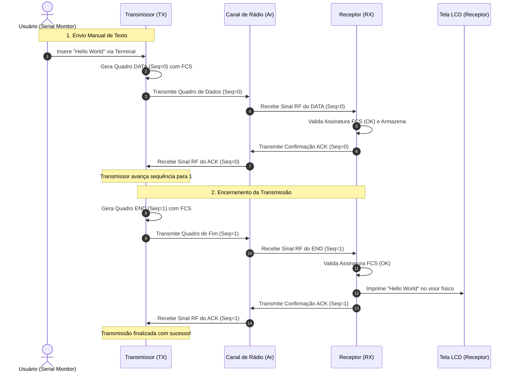

# Como o Projeto Funciona: Passo a Passo

Este documento apresenta a descrição detalhada e o fluxo de execução lógica do protocolo de comunicação de dados sem fio estabelecido entre o transmissor e o receptor, utilizando uma abordagem estruturada passo a passo.

---

## A Analogia com o Sistema Postal

Para elucidar os princípios de transmissão por radiofrequência (RF) e o controle de fluxo projetado, pode-se traçar um paralelo com um serviço postal de entrega:
*   **Fragmentação de Dados:** Um documento extenso (mensagem de texto) é subdividido em páginas menores para caber em envelopes com capacidade restrita a 24 caracteres (limite definido pelo `MAX_PAYLOAD`).
*   **Confirmação de Recebimento (ACK):** O remetente envia um único envelope e suspende novos envios até receber um cartão de confirmação assinado pelo destinatário atestando o recebimento daquela página específica (ex: "Recebi a página 0").
*   **Estouro de Tempo (Timeout):** Caso a confirmação de recebimento não retorne dentro de um período preestabelecido, presume-se que houve extravio ou dano física à correspondência, disparando a retransmissão automática do mesmo envelope.

---

## 1. Parâmetros Operacionais (Constantes)

Antes da compilação, o sistema configura as seguintes diretivas globais que determinam o comportamento operacional dos dispositivos:

*   **`RF_BITRATE 500`:** Define a taxa de transmissão física do sinal de rádio para 500 bits por segundo. Uma taxa baixa é adotada para minimizar a taxa de erro de bits sob condições severas de ruído ambiental.
*   **`USE_CRC16`:** Seletor lógico que define o algoritmo de integridade. Se definido como `true`, o sistema utiliza o mecanismo matemático **CRC-16-CCITT**; se `false`, adota-se o método **Checksum de 16 bits**.
*   **`ACK_TIMEOUT_MS 2500`:** Limite de tempo (2,5 segundos) que o transmissor aguarda pela resposta de confirmação (ACK) antes de considerar o pacote perdido.
*   **`MAX_RETRIES 6`:** Número máximo de tentativas de retransmissão permitidas antes do encerramento da conexão devido à instabilidade do canal físico.

---

## 2. Inicialização dos Dispositivos (`setup()`)

Ao energizar as placas microcontroladoras ESP32, as seguintes rotinas de hardware e software são executadas:

1.  **Rotina do Transmissor (TX):**
    *   Inicializa a comunicação serial via USB a 115200 bps (`Serial.begin`) para permitir o envio de dados via terminal e exibição de logs.
    *   Inicializa o driver de radiofrequência (`driver.init()`).
    *   Exibe no monitor de saída a tela de inicialização do sistema com os comandos disponíveis.
2.  **Rotina do Receptor (RX):**
    *   Inicializa o canal de comunicação serial USB.
    *   Inicializa o driver de recepção de radiofrequência.
    *   Inicializa e limpa a tela do display LCD físico (I2C), exibindo a mensagem de status "Aguardando dados".

---

## 3. Fluxo de Transmissão da Mensagem "Hello World"

Abaixo descreve-se o caminho e a transformação dos dados desde a entrada do comando do usuário até a exibição no receptor:

```
[Terminal do Usuário] ──(Texto: "Hello World")──> [ESP32 Transmissor]
                                                         │
                                                (Construção do Quadro
                                                 e Cálculo do FCS)
                                                         │
                                                         ▼
                                                [Antena Transmissora]
                                                         │
                                                  ((( Ondas de )))
                                                  ((( Radiofreg.)))
                                                         │
                                                         ▼
                                                 [Antena Receptora]
                                                         │
                                                (Validação do FCS
                                                 e Reconstrução)
                                                         │
                                                         ▼
                                                 [Display LCD / RX]
```

### Fase A: Processamento e Envio (Transmissor)
1.  O usuário envia a string `"Hello World"` através do terminal serial.
2.  O sistema identifica a entrada e chama o método **`sendTextMessage()`**.
3.  Como a string contém 11 bytes, ela é alocada integralmente em um único bloco, dispensando fragmentações múltiplas.
4.  O método **`buildFrame()`** monta a estrutura de cabeçalho e rodapé do quadro de dados:
    *   Insere o byte delimitador de início de quadro `0xA5` (Magic Byte).
    *   Configura os metadados: tipo de quadro (`TYPE_DATA`), sequência (`0`) e tamanho útil (`11`).
    *   Copia a mensagem `"Hello World"` para a seção de payload.
    *   Chama a função **`calcFCS()`** para calcular o código de verificação dos dados e anexa os 2 bytes resultantes ao final da estrutura.
5.  O transmissor comuta a antena para modo de envio, emite o quadro binário gerado e dispara o temporizador interno de confirmação (`waitForAck()`).

### Fase B: Recepção e Validação (Receptor)
1.  O receptor detecta as oscilações de rádio e realiza a leitura do buffer bruto recebido.
2.  Chama a função **`decodeFrame()`** para validação:
    *   Verifica se o tamanho atende aos requisitos mínimos de cabeçalho e valida a assinatura inicial (`0xA5`).
    *   Recalcula localmente a assinatura (FCS) e compara com os bytes finais recebidos do transmissor.
    *   **Quadro Corrompido:** Caso as assinaturas divirjam, o receptor descarta o pacote de forma silenciosa e aguarda o próximo sinal de transmissão.
    *   **Quadro Íntegro:** Se as assinaturas forem idênticas, o receptor armazena o payload no buffer interno.
3.  O receptor introduz uma pausa de **450 milissegundos** para garantir que a comutação de hardware do transmissor (de TX para RX) seja concluída.
4.  O receptor constrói um quadro de confirmação (**ACK**) com tamanho de 6 bytes e envia o pacote de volta com o respectivo número de sequência (`0`).

### Fase C: Conclusão do Protocolo (Transmissor & Receptor)
1.  O transmissor capta o quadro de confirmação (ACK 0), valida seus metadados e avança para a próxima etapa, alternando a sequência esperada de `0` para `1`.
2.  O transmissor monta e envia um quadro sinalizador do tipo **`TYPE_END`** (Fim de Transmissão) com sequência `1` para indicar o término da mensagem.
3.  O receptor capta o quadro de encerramento, retorna o respectivo ACK 1 ao transmissor e finaliza o processo:
    *   Insere o caractere terminador `\0` para transformar os bytes do buffer em uma String de C válida.
    *   Exibe a mensagem `"Hello World"` no monitor serial e no LCD físico.
    *   Reseta o buffer interno, retornando ao estado de escuta.

---

## 4. Diagrama de Estados do Protocolo

O fluxo a seguir ilustra a sequência cronológica de troca de mensagens e confirmações entre as duas pontas sob o protocolo Stop-and-Wait ARQ:


