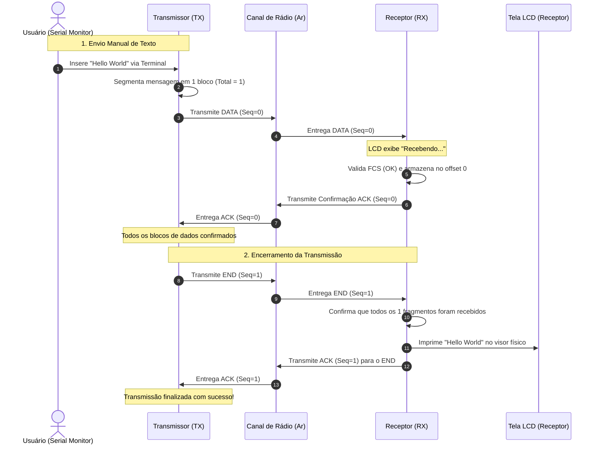

# Como o Projeto Funciona: Passo a Passo

Este documento apresenta a descrição detalhada e o fluxo de execução lógica do protocolo de comunicação de dados sem fio estabelecido entre o transmissor e o receptor, utilizando uma abordagem estruturada passo a passo sob o modelo **Selective Repeat ARQ**.

---

## A Analogia com o Sistema Postal

Para elucidar os princípios de transmissão por radiofrequência (RF) e o controle de fluxo projetado, pode-se traçar um paralelo com um serviço postal de entrega com janela deslizante:
*   **Fragmentação de Dados:** Um documento extenso (mensagem de texto) é subdividido em páginas menores para caber em envelopes com capacidade restrita a 24 caracteres (limite definido pelo `MAX_PAYLOAD`).
*   **Janela Deslizante de Transmissão:** O remetente pode colocar na caixa de correio até 4 envelopes consecutivos (tamanho da janela $W = 4$) de uma única vez, sem a necessidade de esperar que o destinatário confirme o primeiro para selar os demais.
*   **Confirmação Seletiva (ACK Individual):** O destinatário envia um cartão postal confirmando individualmente o recebimento de cada página específica (ex: "Recebi o envelope 2").
*   **Retransmissão Seletiva:** Se o envelope 1 for extraviado mas os envelopes 0, 2 e 3 forem entregues com sucesso, o remetente receberá confirmações para os envelopes 0, 2 e 3. Ele identificará que apenas o envelope 1 falhou e retransmitirá **exclusivamente o envelope 1**, otimizando a eficiência e o uso do canal.
*   **Reorganização no Destinatário:** O destinatário armazena os envelopes recebidos fora de ordem e os posiciona na ordem correta das páginas correspondentes, fazendo a leitura do documento apenas quando todas as páginas estiverem presentes.

---

## 1. Parâmetros Operacionais (Constantes)

Antes da compilação, o sistema configura as seguintes diretivas globais que determinam o comportamento operacional dos dispositivos:

*   **`RF_BITRATE 500`:** Define a taxa de transmissão física do sinal de rádio para 500 bits por segundo. Uma taxa baixa é adotada para minimizar a taxa de erro de bits sob condições severas de ruído ambiental.
*   **`WINDOW_SIZE 4`:** Tamanho da janela deslizante que estipula o número máximo de pacotes que o transmissor pode enviar consecutivamente sem receber confirmações intermediárias.
*   **`USE_CRC16`:** Seletor lógico que define o algoritmo de integridade. Se definido como `true`, o sistema utiliza o mecanismo matemático **CRC-16-CCITT**; se `false`, adota-se o método **Checksum de 16 bits**.
*   **`ACK_TIMEOUT_MS 2500`:** Limite de tempo (2,5 segundos) que o transmissor aguarda pela resposta de confirmação de cada pacote individual antes de disparar sua retransmissão seletiva.
*   **`MAX_RETRIES 6`:** Número máximo de tentativas de retransmissão permitidas para cada bloco individual antes do encerramento da conexão devido à instabilidade do canal físico.

---

## 2. Inicialização dos Dispositivos (`setup()`)

Ao energizar as placas microcontroladoras ESP32, as seguintes rotinas de hardware e software são executadas:

1.  **Rotina do Transmissor (TX):**
    *   Inicializa a comunicação serial via USB a 115200 bps (`Serial.begin`) para permitir o envio de dados via terminal e exibição de logs.
    *   Inicializa o driver de radiofrequência (`driver.init()`).
    *   Exibe no monitor de saída a tela de inicialização do sistema com os comandos disponíveis.
2.  **Rotina do Receptor (RX):**
    *   Inicializa a comunicação serial USB.
    *   Inicializa o driver de recepção de radiofrequência.
    *   Inicializa e limpa a tela do display LCD físico (I2C), exibindo a mensagem de status `"RX pronto"` na primeira linha e `"Aguardando..."` na segunda.

---

## 3. Fluxo de Transmissão da Mensagem "Hello World"

Abaixo descreve-se o caminho e a transformação dos dados desde a entrada do comando do usuário até a exibição no receptor:

```
[Terminal do Usuário] ──(Texto: "Hello World")──> [ESP32 Transmissor]
                                                         │
                                                (Construção do Quadro
                                                 e Cálculo do FCS)
                                                         │
                                                         ▼
                                                [Antena Transmissora]
                                                         │
                                                  ((( Ondas de )))
                                                  ((( Radiofreg.)))
                                                         │
                                                         ▼
                                                 [Antena Receptora]
                                                         │
                                                (Validação do FCS
                                                 e Reconstrução)
                                                         │
                                                         ▼
                                                 [Display LCD / RX]
```

### Fase A: Processamento e Envio (Transmissor)
1.  O usuário envia a string `"Hello World"` através do terminal serial do transmissor.
2.  O sistema identifica a entrada e chama o método **`sendTextMessage()`**.
3.  Como a string contém 11 bytes, ela é dividida em apenas **1 fragmento** (índice 0), pois o tamanho é inferior ao limite de payload de 24 bytes.
4.  O método **`buildFrame()`** monta o quadro de dados com cabeçalho e rodapé:
    *   Insere o byte delimitador de início de quadro `0xA5` (Magic Byte).
    *   Configura os metadados: tipo de quadro (`TYPE_DATA`), sequência (`0`, indicando o índice absoluto do bloco) e tamanho útil (`11`).
    *   Copia a mensagem `"Hello World"` para a seção de payload.
    *   Chama a função **`calcFCS()`** para calcular a assinatura digital (CRC-16 ou Checksum) e anexa os 2 bytes resultantes ao final do quadro.
5.  O transmissor emite o quadro no ar e registra o tempo de envio em `lastSentTime[0]`. Em seguida, inicia o período de 500ms de escuta ativa por ACKs (`listenForAcksDuring()`).

### Fase B: Recepção e Validação (Receptor)
1.  O receptor detecta as oscilações de rádio e realiza a leitura do buffer bruto recebido.
2.  Como é o primeiro bloco recebido da mensagem, o receptor limpa a tela do LCD e exibe temporariamente a mensagem `"Recebendo..."`.
3.  Chama a função **`decodeFrame()`** para validação:
    *   Verifica a assinatura inicial `0xA5` e se o tamanho do pacote é coerente.
    *   Recalcula localmente o FCS e compara com os bytes finais recebidos do transmissor.
    *   **Quadro Íntegro:** O receptor armazena o payload no buffer interno no local exato correspondente ao índice (neste caso, offset `0 * MAX_PAYLOAD`).
4.  O receptor introduz uma pausa de **450 milissegundos** para comutação de hardware e envia de volta um quadro de confirmação (**ACK**) contendo `seq = 0`.

### Fase C: Conclusão do Protocolo (Transmissor & Receptor)
1.  O transmissor capta o `ACK(0)` dentro da janela de escuta, marca o bloco 0 como confirmado (`acked[0] = true`) e avança a janela.
2.  Como todos os fragmentos da mensagem foram confirmados, o transmissor monta e envia um quadro de encerramento do tipo **`TYPE_END`** contendo `seq = 1` (total de fragmentos enviados).
3.  O receptor capta o quadro `END` indicando total de 1 bloco. Ele verifica se todos os blocos do intervalo `0` a `0` foram recebidos.
    *   Constatando a integridade, o receptor envia o `ACK(1)` correspondente ao transmissor e chama a função **`onCompleteMessage()`**.
    *   A função insere o caractere terminador `\0`, imprime a string `"Hello World"` no monitor serial e no LCD físico (permanecendo persistente na tela).
    *   O receptor limpa o buffer e os estados internos de fragmentos, aguardando o próximo ciclo de comunicação.

---

## 4. Diagrama de Estados do Protocolo

O fluxo a seguir ilustra a sequência de troca de mensagens, confirmações e retransmissões seletivas sob o protocolo Selective Repeat ARQ:



---

## 5. Ciclo de Vida da Transmissão de Imagens

O protocolo suporta a transmissão de imagens de forma transparente e flexível:

### A. Imagens em ASCII Art
1. O usuário envia `IMG HEART` no console serial do transmissor.
2. O transmissor gera um array contendo o prefixo `[IMG:ASCII]` e o desenho em texto ($20 \times 4$ caracteres).
3. O bloco é fragmentado em 4 quadros `DATA` e transmitido.
4. O receptor exibe no LCD o progresso dinâmico de blocos recebidos (ex: `Blocos: 1`, `Blocos: 2`, ...).
5. Ao receber o quadro `END` e verificar que todas as partes estão completas, o receptor chama a função `renderAsciiArt()`, que posiciona o cursor linha por linha, redesenhando o coração no display LCD 20x4 sem a quebra automática de caracteres.

### B. Caracteres Customizados (Custom Glyphs)
1. O usuário envia `IMG GLYPH` no transmissor.
2. O transmissor gera um pacote com o prefixo `[IMG:GLYPH]`, define o slot RAM `0` do display e envia os 8 bytes da matriz de pixels de 5x8 (formando a imagem de um Pacman).
3. O receptor extrai esses 8 bytes e chama a função nativa `lcd.createChar(0, pattern)` que define o caractere customizado físico número 0 no circuito do display.
4. O LCD exibe o texto confirmando o registro e renderiza o caractere customizado na tela usando `lcd.write(0)`.

### C. Imagem Real em Hexadecimal (Binário)
1. O usuário converte uma imagem real do PC em string hexadecimal (ex: `"424D360000..."`).
2. O usuário envia `[IMG:HEX]424D360000...` no transmissor.
3. O transmissor lê o prefixo, converte a string hexadecimal de volta para bytes binários puros (economizando 50% de banda de rádio) e monta o buffer binário com a cabeçalho `[IMG:BIN]`.
4. O transmissor envia os bytes usando a janela deslizante do Selective Repeat. O receptor exibe o progresso de blocos na tela LCD.
5. No final da recepção, o receptor reverte os bytes binários de volta para formato de texto hexadecimal, imprime a string reconstruída `[IMG:HEX]...` na tela serial para que o usuário possa copiar e salvar como arquivo original de imagem no PC, e atualiza o LCD confirmando o tamanho recebido.

