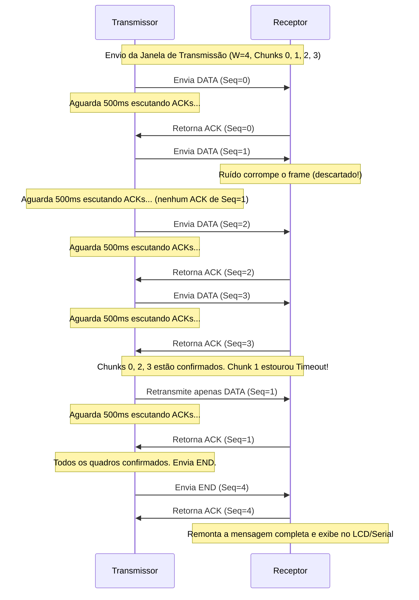

# Controle de Enlace, Estrutura do Quadro e Fluxo

Esta seção detalha o formato dos quadros projetados e o funcionamento do protocolo de controle de enlace de dados baseado em **Selective Repeat ARQ**, incluindo diagramas de fluxo de mensagens.

---

## Estrutura do Quadro (Frame Format)

Para encapsular as informações transmitidas pelo canal físico e permitir a sincronização e verificação de erros no receptor, foi projetada uma estrutura de **quadro customizada**. O frame possui tamanho variável entre **6 e 30 bytes**:

| MAGIC (1B)  |  TYPE (1B)  |  SEQ (1B)   |  LEN (1B)   | PAYLOAD (0-24B)     | FCS (2B, LSB/MSB) |
|-------------|-------------|-------------|-------------|---------------------|-------------------|
|    0xA5     | 0x01/02/03  |   0 a 255   |  0 a 24     | Dados da Mensagem   | Checksum ou CRC16 |

### Campos do Quadro:
1.  **MAGIC BYTE (`0xA5`) [1 Byte]:** Assinatura fixa do frame. Usada pelo receptor para sincronizar o início do quadro e rejeitar ruídos espúrios aleatórios recebidos no canal de rádio.
2.  **TYPE [1 Byte]:** Define o propósito do quadro:
    *   `0x01` (`TYPE_DATA`): Contém fragmento dos dados úteis da mensagem.
    *   `0x02` (`TYPE_ACK`): Sinal de confirmação de recebimento bem-sucedido.
    *   `0x03` (`TYPE_END`): Sinaliza o fim de uma sessão de transmissão de dados.
3.  **SEQ [1 Byte]:** Número de sequência absoluta:
    *   Para **`TYPE_DATA`**: Representa o índice absoluto do fragmento da mensagem (de `0` a `255`).
    *   Para **`TYPE_END`**: Representa o número total de fragmentos ($N$) que compõem a mensagem enviada.
4.  **LEN [1 Byte]:** Especifica o tamanho exato do payload (campo de dados) que está sendo carregado neste quadro (de 0 a 24 bytes).
5.  **PAYLOAD [0 a 24 Bytes]:** O conteúdo útil fragmentado. Ao limitar o tamanho máximo a 24 bytes, mitigamos os índices de erro por ruído de rádio em rajadas longas.
6.  **FCS (Frame Check Sequence) [2 Bytes]:** Código verificador de integridade. Transmitido em formato Little-Endian (Byte Menos Significativo primeiro, seguido do Byte Mais Significativo).

---

## Controle de Fluxo e Erro: Selective Repeat ARQ

Para garantir que toda mensagem seja entregue em perfeito estado, livre de duplicações ou perdas causadas pelo canal físico com ruído, e otimizando a taxa de transferência de dados em comparação ao método clássico de parada-e-espera, implementou-se o algoritmo **Selective Repeat ARQ (Automatic Repeat Request)** com janela deslizante.

### Funcionamento do Algoritmo:

### Regras de Transição de Estado e Detalhes Importantes:
*   **Janela Deslizante de Transmissão (`WINDOW_SIZE = 4`):** O transmissor pode ter até 4 quadros não confirmados consecutivamente em voo antes de bloquear sua progressão.
*   **Armazenamento Desordenado e Escrita Direta:** O receptor possui um vetor de booleanos `chunkReceived` para mapear os índices de blocos recebidos e grava os fragmentos diretamente na posição de memória calculada por `seq * MAX_PAYLOAD`. Isso permite receber os blocos fora de ordem caso ocorra perda no meio da transmissão.
*   **Temporização Seletiva (`ACK_TIMEOUT_MS = 2500`):** Cada quadro enviado possui um registro de tempo individual (`lastSentTime[i]`). Se o temporizador de um bloco específico estourar 2,5 segundos sem a sua confirmação, **apenas esse bloco específico é retransmitido**, poupando largura de banda do canal RF.
*   **Espaçamento Temporal de Envio (500ms):** Como o receptor precisa de 450ms de pausa para comutar fisicamente do modo RX para TX e transmitir a confirmação de recebimento (ACK), o transmissor insere uma janela de escuta ativa de 500ms após o envio de cada bloco. Isso impede colisões de pacotes de rádio e perdas causadas pelo hardware half-duplex.
*   **Verificação de Conclusão no `TYPE_END`:** Quando o transmissor envia o quadro `TYPE_END` com `seq = N` (total de fragmentos), o receptor verifica se todos os blocos de `0` a `N-1` constam como recebidos.
    *   **Se sim:** Retorna o `ACK(N)` para confirmar o término da sessão e reconstrói a mensagem para exibição na porta serial e tela LCD.
    *   **Se não:** Ignora o quadro `END` temporariamente, permitindo que o transmissor dê timeout e retransmita apenas os pacotes de dados que faltaram.
