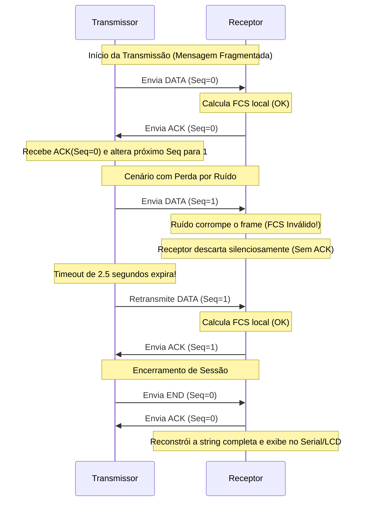

# Controle de Enlace, Estrutura do Quadro e Fluxo

Esta seção detalha o formato dos quadros projetados e o funcionamento do protocolo de controle de enlace de dados (Stop-and-Wait ARQ), incluindo diagramas de fluxo de mensagens.

---

## Estrutura do Quadro (Frame Format)

Para encapsular as informações enviadas pelo canal físico e permitir a sincronização no receptor, foi projetada uma estrutura de **quadro customizada**. O frame possui tamanho variável entre **6 e 30 bytes**:

| MAGIC (1B)  |  TYPE (1B)  |  SEQ (1B)   |  LEN (1B)   | PAYLOAD (0-24B)     | FCS (2B, LSB/MSB) |
|-------------|-------------|-------------|-------------|---------------------|-------------------|
|    0xA5     | 0x01/02/03  |    0 / 1    |  0 a 24     | Dados da Mensagem   | Checksum ou CRC16 |

### Campos do Quadro:
1.  **MAGIC BYTE (`0xA5`) [1 Byte]:** Assinatura fixa do frame. Usada pelo receptor para sincronizar o início do quadro e rejeitar ruídos espúrios aleatórios recebidos no canal de rádio.
2.  **TYPE [1 Byte]:** Define o propósito do quadro:
    *   `0x01` (`TYPE_DATA`): Contém fragmento dos dados úteis da mensagem.
    *   `0x02` (`TYPE_ACK`): Sinal de confirmação de recebimento bem-sucedido.
    *   `0x03` (`TYPE_END`): Sinaliza o fim de uma sessão de transmissão de dados.
3.  **SEQ [1 Byte]:** Número de sequência de 1 bit (`0` ou `1`), fundamental para controle de fluxo e descarte de quadros duplicados no Stop-and-Wait.
4.  **LEN [1 Byte]:** Especifica o tamanho exato do payload (campo de dados) que está sendo carregado neste quadro (de 0 a 24 bytes).
5.  **PAYLOAD [0 a 24 Bytes]:** O conteúdo útil fragmentado. Ao limitar o tamanho máximo a 24 bytes, mitigamos os índices de erro por ruído de rádio em rajadas longas.
6.  **FCS (Frame Check Sequence) [2 Bytes]:** Código verificador de integridade. Transmitido em formato Little-Endian (Byte Menos Significativo primeiro, seguido do Byte Mais Significativo).

---

## Controle de Fluxo e Erro: Stop-and-Wait ARQ

Para garantir que toda mensagem seja entregue em perfeito estado, livre de duplicações ou perdas causadas pelo canal com ruído, implementou-se o algoritmo **Stop-and-Wait ARQ (Automatic Repeat Request)**.

### Funcionamento do Algoritmo:

### Regras de Transição de Estado e Detalhes Importantes:
*   **Alternância de Sequência (`seq`):** A sequência oscila estritamente entre `0` e `1` a cada envio bem-sucedido. Caso o ACK seja perdido no canal físico e o transmissor envie novamente o mesmo quadro já processado, o receptor reconhece a duplicidade comparando o `seq` recebido com o `expectedSeq`. Ele descarta o dado duplicado mas **reenvia o ACK** para que o transmissor possa progredir no fluxo.
*   **Temporização (Timeout = 2500ms):** Tempo máximo que o transmissor aguarda por um ACK válido. Caso expire, assume perda de pacote e faz a retransmissão automática.
*   **Limite de Retransmissões (`MAX_RETRIES = 6`):** Evita que o transmissor entre em loop infinito caso o enlace físico caia definitivamente.
*   **Tempo de Comutação Física (Delay de 450ms no ACK):** Em hardware de RF simples de 433 MHz, os transistores do transmissor precisam de um intervalo de tempo para desligar antes que o pino do receptor possa ler no canal de forma confiável. Um pequeno atraso (`delay(450)`) é introduzido antes do envio de cada ACK para permitir que o transmissor de origem se coloque em modo de escuta (RX), evitando colisões de comutação.
